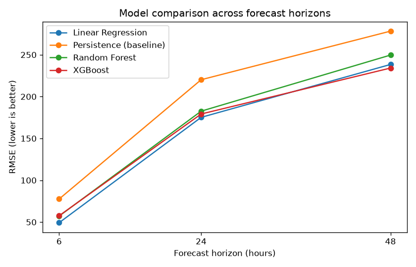
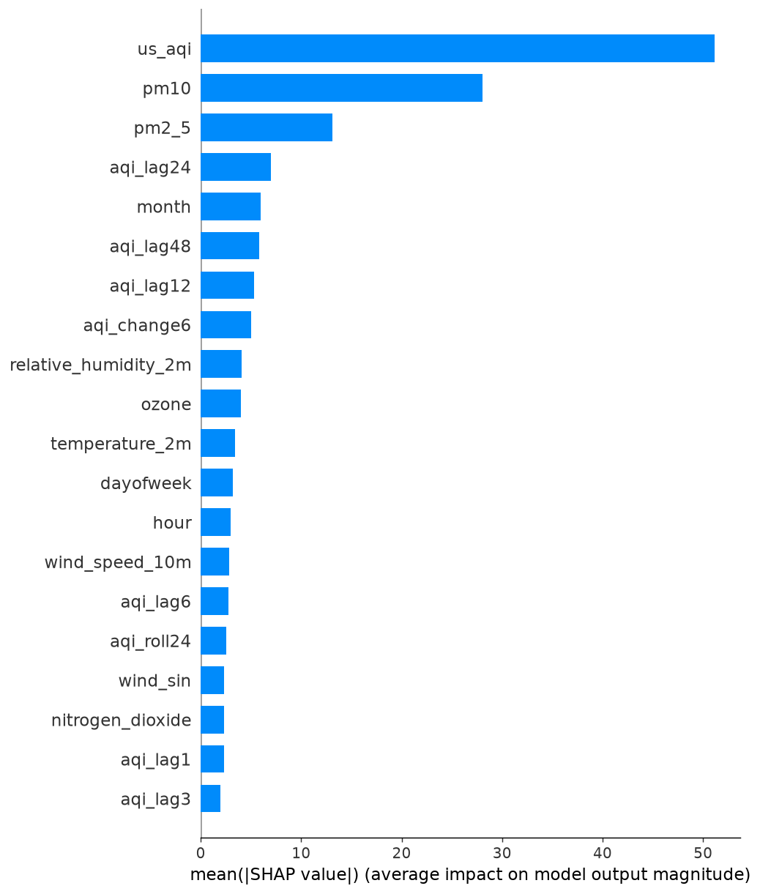

# NCR AQI Forecasting System

Forecasts the Air Quality Index (AQI) **6, 24 and 48 hours ahead** for 8 cities in Delhi NCR, and shows it on a live dashboard with health advice.

**Live app:** [https://aqiforecast-k59scwsghxrkb4zev55itc.streamlit.app/]

**Tech:** Python, pandas, scikit-learn, XGBoost, SHAP, Streamlit

---

## Problem

Delhi NCR often reaches "Very Unhealthy" and "Hazardous" air quality, especially from October to January. People can see today's AQI, but decisions such as school closures, outdoor exercise and pausing construction depend on what the air will be like **tomorrow**. This project predicts it.

**Who can use it:** residents and parents planning outdoor activity, schools deciding on closures, and authorities planning pollution-control measures.

## Data

| Item | Details |
|---|---|
| Cities | Delhi, Ghaziabad, Noida, Greater Noida, Gurugram, Faridabad, Meerut, Sonipat |
| Period | August 2022 to October 2026, hourly |
| Pollution | PM2.5, PM10, NO2, ozone, US AQI (Open-Meteo, from CAMS) |
| Weather | Temperature, humidity, wind speed and direction, precipitation (Open-Meteo, from ERA5) |

> **Limitation:** this is satellite and computer-model data, not readings from ground sensors. Nearby cities can therefore look similar, and values can differ from phone AQI apps that use ground sensors. Adding CPCB / OpenAQ sensor data is the next planned improvement.

## Approach

1. **Data collection:** downloaded hourly pollution and weather data for all 8 cities through the Open-Meteo API.
2. **Cleaning:** filled short gaps (up to 6 hours) by interpolation, per city.
3. **Feature engineering:** AQI lags (1, 3, 6, 12, 24, 48 hours), 24-hour rolling average, 6-hour change, wind direction as sin/cos, hour, day of week, month and city.
4. **Time-based split:** trained on the oldest 80% of the data and tested on the newest 20%, so the model never sees the future.
5. **Models compared:** Persistence baseline ("future AQI = current AQI"), Linear Regression, Random Forest and XGBoost, at three forecast horizons.
6. **Explainability:** SHAP values.
7. **Deployment:** Streamlit dashboard hosted on Streamlit Community Cloud. It fetches the latest data, builds the same features and predicts the next 24 hours.

## Results

RMSE on the test set (lower is better):

| Model | 6 hours | 24 hours | 48 hours |
|---|---|---|---|
| Persistence (baseline) | 77.59 | 220.17 | 278.23 |
| Linear Regression | **49.27** | **175.20** | 238.40 |
| Random Forest | 57.19 | 182.59 | 249.62 |
| XGBoost | 57.58 | 179.20 | **234.13** |

XGBoost improvement over the baseline: **25.8%** (6h), **18.6%** (24h), **15.9%** (48h).



**Findings**
- All models beat the baseline at every horizon.
- Error grows as the forecast looks further ahead, as expected.
- Linear Regression is slightly better at 6 and 24 hours, while XGBoost is best at 48 hours.

## What drives the predictions (SHAP)



For the 24-hour forecast, the most important features were the current AQI, PM10 and PM2.5 levels, AQI 12 to 48 hours ago, the month (season) and relative humidity.

Wind speed and direction ranked lower than expected. One possible reason is that the model-based data already smooths the effect of weather. This should be re-checked with ground-sensor data.

## Run it locally

```
pip install -r requirements.txt
python get_data.py
python prepare_data.py
python train_model.py
python step4_compare_models.py
python step5_shap.py
python -m streamlit run app.py
```

## Project files

| File | Purpose |
|---|---|
| `get_data.py` | Downloads pollution and weather data for the 8 cities |
| `prepare_data.py` | Cleans data and creates features |
| `train_model.py` | Trains the first XGBoost model against a baseline |
| `step4_compare_models.py` | Compares 4 models at 6, 24 and 48 hours |
| `step5_shap.py` | Explains the model with SHAP |
| `app.py` | Streamlit dashboard |
| `models/` | Saved model files |
| `requirements.txt` | Python packages |

## Limitations and next steps

- Data comes from a satellite/model product, not ground sensors. Add CPCB or OpenAQ data and compare.
- Add uncertainty ranges (for example, "AQI 280 to 340") instead of a single number.
- Add a deep-learning model (LSTM) for comparison.
- Retrain automatically every week with GitHub Actions.
- Serve the model through an API (FastAPI).
